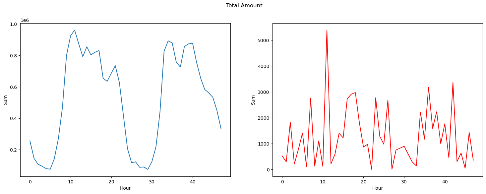
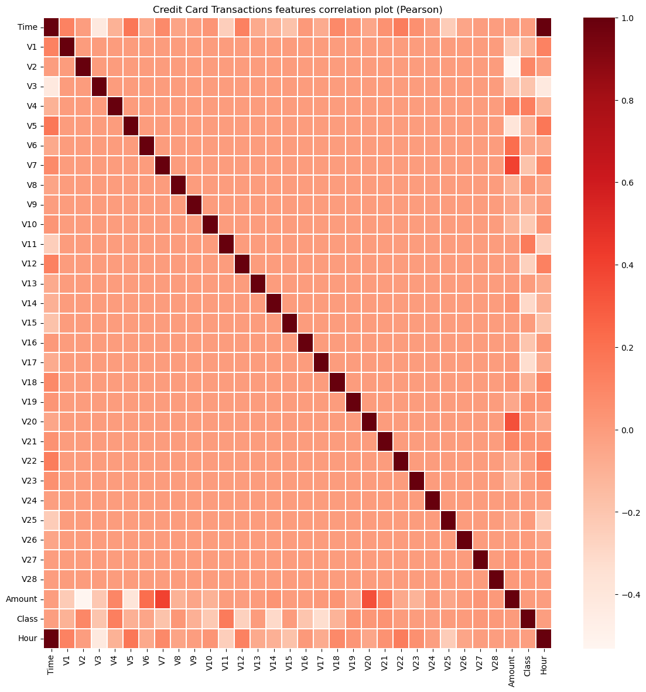
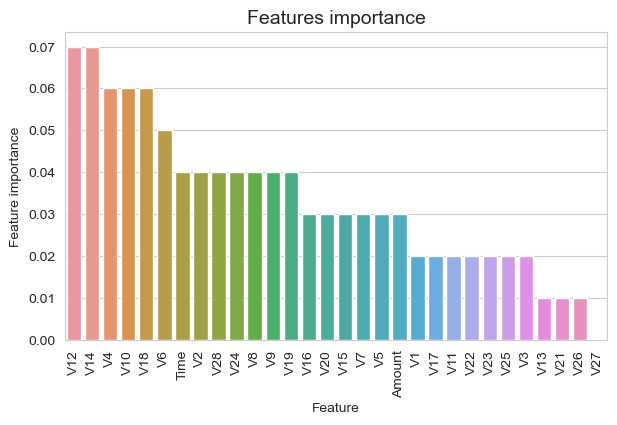
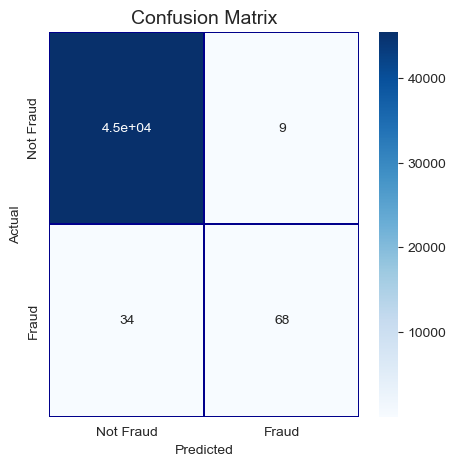

# Credit Card Fraud Detection

## Project Overview
This project aims to detect fraudulent transactions from credit card data using machine learning models. It leverages various algorithms and feature engineering techniques to identify potentially fraudulent activities effectively.

## Technologies Used
- Python
- Pandas, NumPy for data manipulation
- Matplotlib, Seaborn for visualization
- Scikit-learn, XGBoost, LightGBM, CatBoost for machine learning models

## Data Preprocessing
The data was cleaned to handle missing values, outliers, and perform encoding of categorical variables. Feature engineering was conducted to derive meaningful insights from the transaction data, which is crucial for effective model training.

## Exploratory Data Analysis (EDA)
We explored data distributions and relationships between features to understand the dynamics influencing transactions. The visualizations below depict various aspects of the data:

### Transaction Amount Distribution


### Feature Correlations
Understanding correlations between features helps in determining redundant features and understanding feature interactions.


## Model Building & Evaluation
We built several models to evaluate their performance in detecting fraudulent transactions. Below are some highlights from the modeling phase:

### Models Used:
- **Random Forest Classifier**
- **AdaBoost Classifier**
- **CatBoost Classifier**
- **XGBoost**

Each model's performance was evaluated based on accuracy, precision, recall, F1-Score, and the ROC-AUC score.

### Model Performance
- **Random Forest Classifier**
  - ROC-AUC: 0.85

- **AdaBoost Classifier**
  - ROC-AUC: 0.83

- **CatBoost Classifier**
  - ROC-AUC: 0.86

- **XGBoost**
  - ROC-AUC: 0.98

### Feature Importance
Understanding which features most significantly impact model decisions is crucial for interpreting model behavior.
- **AdaBoost Feature Importance**
  

### Confusion Matrix
Confusion matrices for models show how well the models are able to classify fraudulent and non-fraudulent transactions.
- **AdaBoost Confusion Matrix Example**
  

## Challenges and Learnings
The primary challenge was dealing with imbalanced data, common in fraud detection scenarios. Techniques like SMOTE and adaptive sampling helped improve model performance.

## Future Work
Future improvements will focus on:
- Implementing deep learning models to enhance detection capabilities.
- Advanced feature engineering to capture non-linear relationships and interactions between features.

## Conclusions
The project demonstrates the effectiveness of ensemble machine learning techniques in detecting fraudulent transactions. Continuous improvement in feature engineering and model tuning will be key to advancing this work.

## How to Run This Project
Ensure you have the necessary Python packages installed:
```bash
pip install pandas numpy matplotlib seaborn scikit-learn xgboost lightgbm catboost
